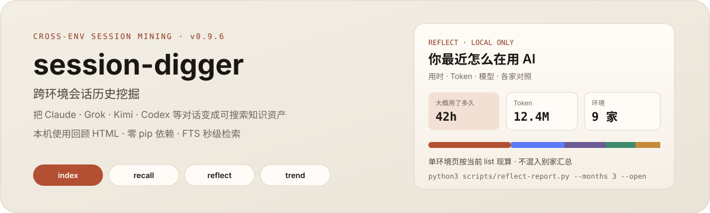

# session-digger

<p align="center">
  
</p>

<p align="center">
  <a href="https://github.com/taxueseek/session-digger/releases"></a>
  <a href="LICENSE"></a>
  <a href="#支持的环境"></a>
  <a href="#快速开始"></a>
</p>

跨环境会话历史挖掘。把 Claude Code、Grok、Kimi、Codex、Kimix 等对话变成**可搜索的知识资产**，生成本机 **AI 使用回顾 HTML**，并提供**跨环境 Token 用量与缓存命中率统计**。中文检索原生支持——「去AI味」「数据库迁移」这类词组直接命中。

分析过一次的会话不再重复解析；索引增量更新，检索走 SQLite FTS5。**零 pip 依赖**，clone 即用。

---

<p>
  
</p>

### 通用安装（推荐）

```bash
# 方式一：npx 一键安装
npx -y skills add taxueseek/session-digger -g --all

# 方式二：git clone
git clone https://github.com/taxueseek/session-digger.git
cd session-digger
```

仅需 Python 3.9+ 标准库。克隆后可直接运行 `python3 scripts/` 下工具。

> 下限是 3.9 而不是更早：注解里用了 `list[str]` / `dict[str, int]` 这类内置泛型，
> Python 3.8 及以下在函数定义时就会 `TypeError`。macOS 自带的 `python3` 是 3.9.6，
> 按文档裸调 `python3` 即可。此前 `skill-gap-finder.py` 用了 `@dataclass(slots=True)`
> （需 3.10），在任何 3.9 机器上 import 即崩，已去掉。

### Claude Code 插件

```bash
git clone https://github.com/taxueseek/session-digger.git ~/.claude/plugins/session-digger
```

装完可用：`/recall` `/analyze` `/trend` `/reflect` `/import` 等。

### Herdr 插件

```bash
herdr plugin install taxueseek/session-digger
```

| 能力 | 触发 |
|------|------|
| 搜索历史会话 | `sd-search` |
| 模糊搜索 | `sd-fuzzy-search`（fzf，可降级） |
| 最近会话 | `sd-sessions` |
| 统计面板 | `sd-stats` / `sd-stats-pane` |
| 话题趋势 | `sd-trend` |
| Skill 差距 / 自检 | `sd-skill-gap` / `sd-skill-health` |
| 重建索引 | `sd-reindex` |

---

<p>
  
</p>

```bash
# 1. 建索引（一次即可，后续增量）
python3 scripts/index-builder.py build

# 2. 搜索
scripts/recall-lite.sh "认证 bug"

# 3. 全局统计
python3 scripts/sd-recall.py stats

# 4. 本机使用回顾 HTML（浏览器打开）
python3 scripts/reflect-report.py --months 3 --open

# 5. 趋势
python3 scripts/trend-engine.py period-over-period --unit week
```

**第一次成功：** 索引建好 → `recall-lite` 搜到历史句 → `reflect-report` 看到本机用时与各家分布。

---

<p>
  
</p>

`/reflect` 生成**自包含 HTML**（不上网），适合复盘「用了多久、花在哪、什么时候忙」。

**v0.9.6 亮点：**

| 能力 | 说明 |
|------|------|
| 首页用量总览 | 用时概况 + Token 消耗 + 模型偏好（双栏） |
| 单环境隔离 | 进入 Kimi 等子页时，洞察按当前 list 现算，不混 Claude 等全库汇总 |
| 主题 | 跟随系统 / 奶油暖色 / 深褐 / 纯黑 / 冷蓝 / 墨纸 |
| 环境标记 | 侧栏色条标记当前家；主题名与强调色不被劫持 |
| 读数诚实 | 有记录才画；错误率非绝对正确率；中文标签「要盯 / 留意 / 提一嘴」 |

```bash
python3 scripts/reflect-report.py --months 3 --open
# 输出默认：~/.claude/.session-digger/reports/reflect-YYYY-MM-DD.html
```

---

## 能做什么

- **跨环境搜索** — Claude / Grok / Kimi / ZCode / Codex / Kimix 等 16+ 环境一网打尽
- **中文全文检索** — CJK 逐字索引，「迁移」「数据库」等中文词组秒级命中（0.9.16 修复中文搜索命中为 0 的问题）
- **Token 用量统计** — 跨环境汇总各模型账单级 token 与缓存命中率（`/usage`）
- **错误根因分析** — 单会话错误模式 + 用户意图分类（`/analyze` → deep-analysis）
- **环境健康诊断** — 跨 AI 编码环境自检（`/env-doctor`）
- **导入外部对话** — 微信 JSON/CSV、会议记录、纯文本
- **微信数据分析（子技能 wechat-digger）** — 对已解密的微信库做全史检索、群画像、商机跟进、跨会话成文；不含密钥提取与解密栈
- **极速检索** — FTS5 + mtime 增量缓存
- **趋势分析** — 周/月环比，纯算术聚合
- **使用回顾** — 本机 HTML：热力日历、任务结构、Token / 模型
- **记忆时效** — 永久 / 周期 / 一次性分层
- **技能差距** — 跨会话痛点 → SKILL.md 提案（需人工确认）
- **自动记忆** — `remember.py` 从索引生成 `memory/*.md`
- **Herdr 集成** — 动作 + 统计面板 + 工作树预热

---

## 命令参考

### 搜索与回顾

| 命令 | 用途 |
|------|------|
| `/recall <topic>` | 搜索历史决策、错误、话题 |
| `/recap [N]` | 总结近期会话 |
| `/reflect` | 本机多环境使用回顾 HTML |
| `/timeline` | 会话 + git 时间线 |
| `/topics` | 话题切分 |

### Token 用量与分析

| 命令 | 用途 |
|------|------|
| `/usage` | 跨环境 Token 用量 + 缓存命中率统计 |
| `/analyze` | 重试循环、错误模式、意图分类 |
| `/dashboard` | 全局概览、记忆状态 |

### 索引 · 导入 · 记忆

| 命令 | 用途 |
|------|------|
| `/index` | 构建/更新 FTS 索引 |
| `/import` | 导入外部对话 |
| `/audit` `/extract` `/prune` `/apply` | 记忆生命周期 |

### CLI（无需插件）

```bash
python3 scripts/sd-recall.py search <keyword>
python3 scripts/sd-recall.py sessions
python3 scripts/sd-recall.py stats
python3 scripts/reflect-report.py --months 3 --open
python3 scripts/trend-engine.py period-over-period --unit week
python3 scripts/skill-gap-finder.py --min-occurrences 3
python3 scripts/remember.py
```

---

<p>
  
</p>

| 环境 | 格式要点 |
|------|----------|
| Claude Code | JSONL |
| Grok Build | chat_history.jsonl + events.jsonl |
| Kimi Code | wire.jsonl |
| Kimix CLI | jsonl（复用 Grok Build 适配器） |
| Codex | response_item + event_msg |
| Cursor | agent-transcripts JSONL + SQLite |
| WorkBuddy | parentId 树 |
| Trae CN | LLM 摘要层 |
| ZCode | SQLite + transcript.jsonl |
| ZCode v2 | Claude 同构 transcript（agent-config / acp-config） |
| DSH | zstd 压缩事件流（v2 store 优先） |
| Kigi CLI | jsonl（SchemaProbe 通用发现） |
| DIM / Reasonix | memory / sessions 目录 |
| DimCode | SQLite 数据库 |
| 任意聊天 | JSON/CSV/文本（`dialog-adapter.py`） |

未知 JSONL 由 SchemaProbe 探测；路径经环境变量探测，不绑定本机固定目录。

---

## 架构（四层）

| 层 | 脚本 | 作用 |
|----|------|------|
| 0 PARSE | `echolib/` + `jsonl-core` | 原文 → 统计（ground truth） |
| 1 INDEX | `index-builder.py` | SQLite 持久化 / 增量 |
| 2 TREND | `trend-engine` + `deep-analysis` | 聚合 + 单会话错误根因 |
| 3 DECISION | `skill-gap-finder` + `experience-synthesis` | 提案（人工审批） |

## 子技能（`skills/`）

| 子技能 | 能力 |
|--------|------|
| `jsonl-core` | 各环境会话 JSONL 解析 / 恢复 / 格式判定（地基层） |
| `deep-analysis` | 单会话错误根因归类 + 用户意图分类 |
| `experience-synthesis` | 跨会话教训提炼，输出可执行洞察 |
| `memory-management` | 记忆文件生命周期：分层、审计、过期清理 |
| `git-mining` | 会话 ↔ git 交叉分析：热点文件、提交关联 |
| `skill-insight` | 技能用量洞察 + 路由覆盖/安装漂移自检 |
| `skill-search` | skill 先例检索 + 全生命周期（创建/评估/发布） |
| `env-master` | 跨环境统一体检（0-100 评分；env-doctor / native-diag 已并入） |
| `env-radar` | 项目级雷达：30 秒摸清结构/约定/健康/演化 |
| `wechat-digger` | 微信已解密库识别分析：全史检索、群画像、商机跟进、成文（不含密钥/解密栈） |

---

## 版本历史

### v0.9.20 — 双线合并 + wechat-digger 子技能

- 双线合并：0.9.16–0.9.19 主线（Token 用量/缓存命中率/Kimix）与开发线（中文检索/deep-analyze/DSH+ZCode v2 适配）功能全部并入，版本号统一
- 新增 `wechat-digger` 子技能：微信已解密库的全史检索、群画像、商机跟进、跨会话成文；只含分析层，密钥提取与解密栈不分发（见 `skills/wechat-digger/SYNC.md`）
- 环境支持扩到 16+：新增 DSH、ZCode v2、Kigi CLI

### v0.9.19 — Kimix CLI 适配

- 新增 Kimix CLI 环境适配器（`_adapters_kimix.py`）
- `ENV_REGISTRY` 添加 Kimix 环境（`~/.kigi/sessions/`）
- 支持 `/usage` 跨环境汇总 Kimix CLI token 用量与缓存命中率

### v0.9.18 — 子技能调优

- 专精优先协议：意图匹配子技能直接加载，避免主命令空转
- 索引先行：分析前确认 SQLite FTS5 索引可用
- deep-analysis 挂载 combo_map

### v0.9.17 — 三瓶颈硬化

- hub 边界卫生 + `_helpers` 补充 `_empty_stats`
- 新增 `_policy.PROVIDER_POLICY` 与 `usage_tier` 门控
- Codex token 真源修复（`total_token_usage` 嵌套字段 + 累计快照取 max）

### v0.9.16 — 主命令精简 + `/usage`

- 路由表收敛为 5 主命令：`/recall` `/usage` `/reflect` `/analyze` `/dashboard`
- 新增 `/usage`：跨环境汇总各模型账单级 token 与缓存命中率

### v0.9.15 — 主对话 / 子代理分列

- token 与缓存命中按 session_role 分列（主对话 / 子代理不混算）

### v0.9.14 — 缓存报表口径固化

- 主表仅会话均命中率；异常单独列；禁止默认加权

### v0.9.13 — 增量索引与缓存命中语义

- `input_includes_cache` 显式语义（非缓存 leg vs 总量含缓存）

### v0.9.6 — Reflect 可视化 + 单环境数据隔离

- 首页用量总览：用时 / Token / 模型偏好
- 洞察按当前时段与环境现算；子页不混全库汇总
- 主题对比度校准；环境色与主题名解耦
- 中文发现标签与读数免责

---

## License

[ISC](LICENSE)

---

<p align="center">
  <sub>session-digger v0.9.19 · 本机优先 · 只读会话 · 不上网报告</sub>
</p>
